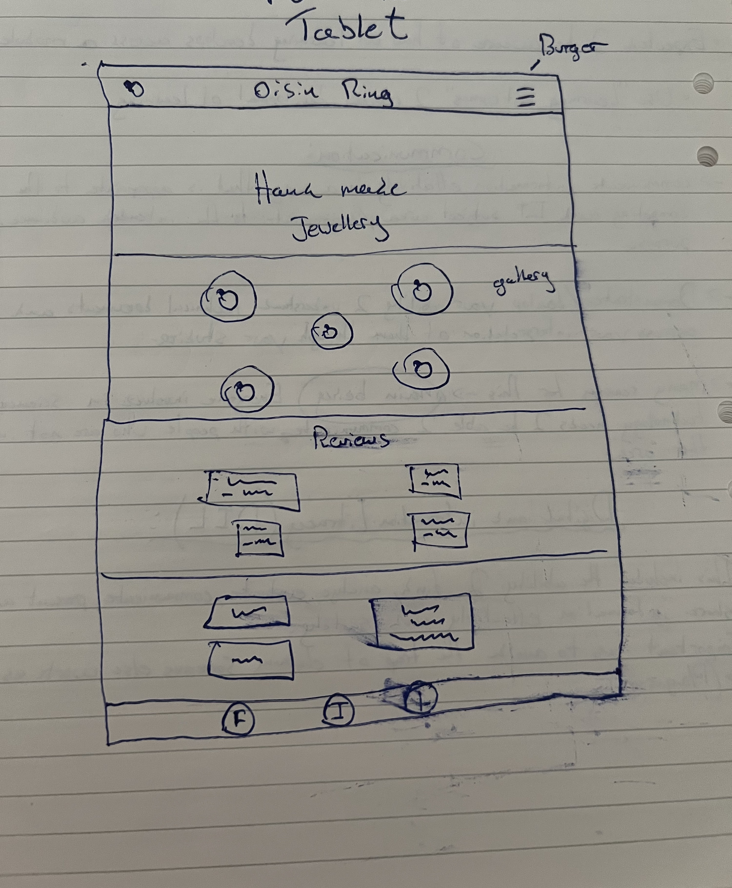
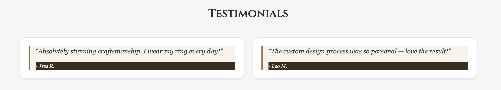
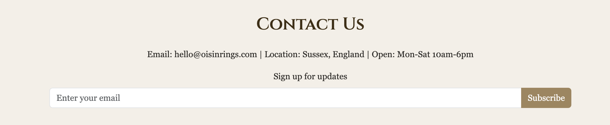

# Oisin Rings: Handcrafted Jewellery Portfolio-1-Milestone-Project


This project is the front-end for Oisin Rings, an online store specialising in bespoke, handcrafted silver jewellery. I built this site as a Milestone Project to showcase my current front-end development abilities using HTML, CSS and Bootstrap. The site aims to provide a clear, elegant and engaging platformfor customers to explore unique, nature-inspi

View a link to the deployed site [here](https://axelaxel97.github.io/Oisin-Rings-Portfolio-1-Milestone-Project/#hero)

---

**First-Time Visitor Goals:**
* As a new visitor, I want to quickly understand what Oising Rings sells (handcrafted rings) so I know if it's relevant to me.
* As a new visitor, I want to easily navigate the site to find different sections like "About," "Shop," and "Contact" so I can  explore without getting lost.
* As a new visitor, I want to see beautiful images of the rings so I can appreciate the craftsmanship and design.
* As a new visitor, I want to understand the unique selling points, such as recycled silver and ethically sourced gemstones, to know the brand's values.
* As a new visitor, I want to easily find how to get a custom ring so I can explore personalized options.

**Returning Visitor Goals:**
* As a returning visitor, I want to quickly access the "Shop" section to see new collections or revisit past designs.
* As a returning visitor, I want to read customer testimonials to reinforce my positive impression of the brand.
* As a returning visitor, I want to easily fill out the custom ring inquiry form to start a new project.
* As a returning visitor, I want to quickly find contact information or subscribe to the newsletter for updates.


### Wireframes
- The very first wireframe i created of my project was by pen and paper, which i have included below. 



- As you can see its a very rough outline of the finished product but together with the Story board i created in the projects section of my repository i was able to make sense of it rather quickly.

## Design

With the overall design i tried to stay as minimalistic as possible with a single page application structure. The responsive layout guarantees a consistent and beautiful presentation across all devices, relating to the brand's commitment to quality from every perspective.


### Font and Colour choices

**Fonts:** The typography of Oising Rings combines classic elegance with a distinct artisan feel, using fonts imported from Google Fonts.
'Georgia', serif: This traditional serif font is used for the body text and card-title, providing top readability for paragraphs and a timeless feel that aligns with the handcrafted nature of the jewellery. It's a highly accessible font with good legibility.

**Colours:** This site is designed with a sophisticated color palette, comprising soft beiges and subtle dark earthy tones, forms the foundational backdrop, allowing the intricate details of the jewelry to be highlighted. This is contrasted by a vibrant crimson red for key heading. 


 **Primary Background (`#f3efe7`)** 
 - A soft, light beige providing a warm and inviting base, reminiscent of natural stone or parchment.
 
 **Secondary Background (`#e2dcd0`)**
 - A slightly darker, muted beige used for elements like the navbar, adding subtle depth.
 
 **Body Text (`#2d2b27`)**
 - A deep, rich charcoal brown, ensuring readability while maintaining the earthy aesthetic.
 
 **Primary Headings (`#3f2e13`)**
 - A darker brown, almost black, used for main section titles, providing strong contrast and gravitas.
 
 **Link/Accent (`#4a3c1a`)**
 - A warm, mid-brown used for navigation links, ensuring they stand out while harmonizing with the overall palette.
 
 **Hero Heading Accent (`#DC143C` - Crimson Red)**
 - A vibrant, bold red specifically chosen for the main hero heading to create a strong visual impact and draw immediate attention.
 
 **Button Primary (`#6b4c2b`)**
 - A robust, medium-dark brown for primary call-to-action buttons, suggesting durability and natural materials.
 
 **Button Secondary (`#a0855b`)**
 - A lighter, more muted brown for secondary actions, offering a softer alternative.
 
 **Footer Background (`#3b2e1b`)**
 - A very dark, almost black-brown, providing a solid, grounding base for the footer content.
 
 **Footer Link (`#d9c29c`)**
 - A light, desaturated gold/beige for footer links, offering good contrast against the dark background.
 
 **Card Background (`#fefcf9`)**
 - A very light, almost white, subtle creamy tone for product cards, making the product images and text pop.

## Features

This site implements the very basic features of a static website.

### Existing Features
- **Responsive Navigation Bar**
    - Featured in the header at the top of the page. Includes the club's logo and links to the sections, About, Shop,     Testimonials, Custom Rings and Contact. 
    - Uniform format allows for easy navigation on all pages without the use of the "back" button but scrolling.
   
    

**Hero Section**: A dynamic and visually impactful `header` at the top of the page, featuring a large muted background and a compelling headline and tagline.


**Footer**: A consistent `footer` across the bottom, containing copyright information and links to social media (Facebook, Instagram, Twitter) via Font Awesome icons.


**Product gallery**: An dynamic three image gallery displaying images of stock options with discriptions.(Silver band, Silver Ember Rings, Custom Design).


**Testimonials**: A quote and name from previous customers expressing gratitude. 



**Create A Custom Ring Form**: A form where first time visitors or returning customers can inquire about custom designs. 


**Contact Us**: An additional form where casual browsers or returning customers/business can as general questions. 



### Future Implementations
**E-commerce Functionality**: Integrate a shopping cart and checkout system to allow direct purchases of "ready to order" rings.
 
**Product Detail Pages**: Create individual pages for each ring with more images, detailed descriptions, sizing options, and material information.
 
**Advanced Filtering/Search**: Implement search and filtering options in the shop section to help users find specific ring styles, materials, or gemstones.
 
**Blog/News Section**: Add a blog to share insights into the crafting process, new collections, or behind-the-scenes content.
 
**User Accounts**: Allow users to create accounts to save preferences, track orders, and manage custom design inquiries.
 
**Image Gallery for Custom Designs**: Showcase a portfolio of past custom ring projects to inspire potential clients.
 
**Interactive Design Tool**: Potentially implement a simple tool for users to visualize basic custom ring elements.

### Accessibility
Accessibility has been considered throughout the development process to ensure my project is usable by as many people as possible.

**Semantic HTML**: Used appropriate HTML5 semantic elements (`<header>`, `<nav>`, `<section>`, `<footer>`, `<h1>`, `<p>`, ``, `<form>`, `<label>`, `<input>`, `<textarea>`, `<button>`) to provide a clear structure for assistive technologies.

**Clear Contrast**: The color scheme has been chosen to provide good contrast between text and background, particularly for the main body text (`#2d2b27` on `#f3efe7`).

**Accessible Fonts**: 'Georgia' is a highly readable and generally accessible serif font. While 'Cinzel Decorative' is more ornate for the hero `h1`, it's used sparingly and for prominent, short text.

**`alt` attributes**: All `` tags include descriptive `alt` attributes to provide context for screen readers.

**Form Labels**: All form inputs are associated with `<label>` tags for improved usability and accessibility.

**Responsive Design**: The site is fully responsive, ensuring content is accessible and usable on various screen sizes and devices.

## Deployment
This project is deployed using GitHub Pages.

To deploy your own version of this project:
1.  Log in to GitHub and navigate to your project repository.
2.  Click on the "Settings" tab.
3.  In the left sidebar, click on "Pages."
4.  Under "Build and deployment," select "Deploy from a branch" for the source.
5.  Choose the `main` branch (or your preferred branch) and `/ (root)` for the folder, then click "Save."
6.  Your site will be deployed shortly, and the live URL will be displayed in the "Pages" section.

### Local Development
This section explains how to get a local copy of this project running on your machine for development or testing purposes.

#### How to Fork
To create a personal copy of this repository on your GitHub account (a "fork"):
1.  Navigate to the Oising Rings repository on GitHub.
2.  In the top-right corner of the page, click the "Fork" button.
3.  This will create a copy of the repository in your GitHub account under your username.

#### How to Clone
To get a local copy of the project files on your machine:
1.  On the GitHub repository page (either your fork or the original), click the green "Code" button.
2.  In the "Local" tab, select your preferred method (HTTPS, SSH, or GitHub CLI) and copy the provided URL.
3.  Open your terminal or Git Bash.
4.  Navigate to the directory where you want to save the project.
5.  Type `git clone` followed by the copied URL:
    ```bash
    git clone [THE_COPIED_URL_HERE]
    ```
6.  Press Enter, and the project files will be downloaded to your local machine.

## Testing

### Validator Testing
- HTML: 
    - After going back and forth serveral times with errors in the code i managed to organise and structure it to pass. 

- CSS [Jigsaw](assets/images/css-checker.png)
    - No errors found

- Accessibility 
     Attributes to all social links to improve accessibility

- Performance, Accessibility, SEO, Best Practices (Lighthouse Chrome DevTools)
     

### Code Used
 **Bootstrap 5.3**: For the responsive framework and various UI components.
    * Source: [Bootstrap Official Documentation](https://getbootstrap.com/docs/5.3/getting-started/introduction/)
 
 **Google Fonts**: For importing 'Cinzel', 'Cinzel Decorative', and 'Georgia'.
    * Source: [Google Fonts](https://fonts.google.com/)
 
 **Font Awesome**: For social media icons.
   * Source: [Font Awesome CDN](https://fontawesome.com/)


### Acknowledgments
* [Richard Wells(tutor)] For great guidance and feedback throughout the project.
* Code Institute Student Care Team (Kieron): For extreme patience and general help
* The wider Code Institute Slack Community: For helpful discussions and support.

   